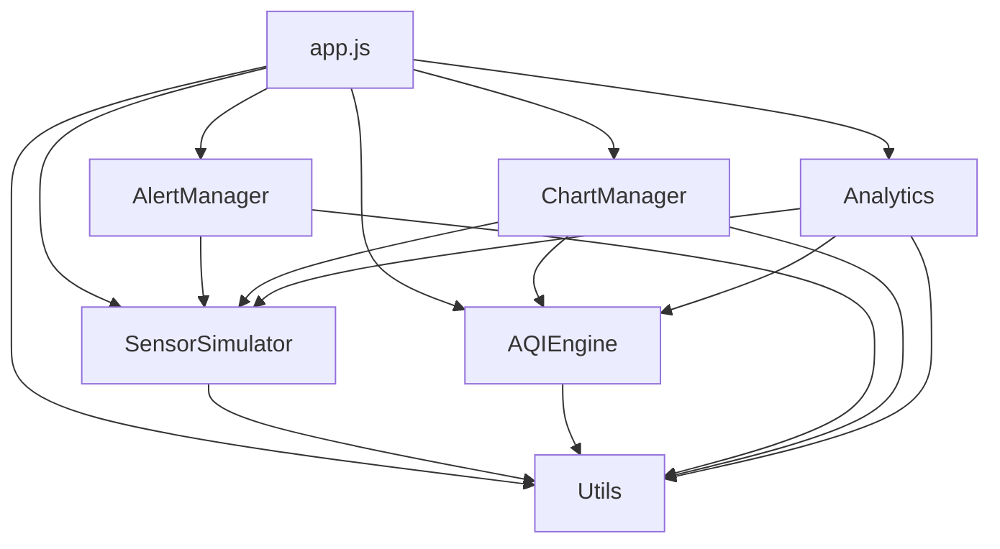

<p align="center">
  
  
  
  
</p>

<h1 align="center">🌬️ Air Monitor Pro</h1>

<p align="center">
  <strong>Real-Time Air Quality Monitoring Dashboard</strong><br>
  A premium, dark-themed web dashboard that delivers live AQI analytics, multi-city pollutant tracking, health recommendations, and interactive data visualizations — all in your browser.
</p>

---

## 📸 Overview

**Air Monitor Pro** is a feature-rich, single-page air quality monitoring application built with vanilla HTML, CSS, and JavaScript. It simulates realistic sensor data based on historical pollution averages for **50+ cities** across India and the world, computes EPA-standard AQI scores, and presents everything through a stunning dark-themed dashboard with real-time charts, configurable alerts, and actionable health insights.

---

## ✨ Features

### 🎯 Core Functionality
- **Real-Time AQI Dashboard** — Live-updating circular gauge with color-coded AQI categories (Good → Hazardous)
- **6 Pollutant Metrics** — PM2.5, PM10, CO₂, VOC, Temperature, and Humidity with trend indicators
- **EPA AQI Calculation** — Accurate sub-index computation using official EPA breakpoint tables
- **50+ City Database** — Pre-configured baselines for cities across India (Delhi, Mumbai, Bangalore, Chennai, Kolkata, etc.) and international cities (Beijing, London, Tokyo, Sydney, LA)

### 📊 Analytics & Charts (Chart.js)
| Chart Type | Description |
|---|---|
| **Real-Time** | Streaming line chart with toggleable pollutant layers (PM2.5, PM10, CO₂, VOC) |
| **24h Trends** | Historical PM2.5 concentration overlaid with AQI trend line |
| **Weekly** | Bar chart showing daily averages for PM2.5, PM10, and AQI over 7 days |
| **Correlation** | Scatter plot analyzing PM2.5 vs Humidity and VOC vs Temperature relationships |

### 🔔 Alert System
- **Configurable Thresholds** — Set custom warning (⚠️) and danger (🔴) levels for each pollutant
- **Toast Notifications** — Animated in-app toasts with auto-dismiss
- **Browser Notifications** — Native push notifications for critical air quality events
- **Alert History** — Sidebar panel showing recent alerts with timestamps
- **30s Cooldown** — Intelligent deduplication to prevent notification spam
- **Persistent Storage** — Thresholds and alert history saved to `localStorage`

### 🌍 Location Intelligence
- **GPS Auto-Detection** — Browser Geolocation API with reverse geocoding via OpenStreetMap Nominatim
- **Nearest City Matching** — Haversine distance calculation to match GPS coordinates to the nearest monitored city (<200km threshold)
- **Custom Location Support** — Dynamically adds user's city if no predefined match is found
- **Manual Selection** — Dropdown with all 50+ cities grouped by region

### 🏥 Health Recommendations
- **AQI-Based Guidance** — Context-aware health tips ranging from "Safe for outdoor activities" to "Emergency: Stay indoors"
- **Pollutant-Specific Advice** — Targeted recommendations for high CO₂ (ventilation) and VOC (chemical source detection)

### 📤 Data Export
- **CSV Export** — One-click download of all historical data including timestamps, pollutant readings, and AQI values

---

## 🏗️ Architecture

```
Air purifier/
├── index.html              # Main SPA entry point (405 lines)
├── README.md               # This file
├── css/
│   ├── index.css           # Design system, variables, base styles
│   ├── dashboard.css       # Dashboard layout, metric cards, AQI gauge
│   ├── charts.css          # Chart panels, tabs, pollutant toggles
│   └── animations.css      # Keyframe animations, transitions, micro-interactions
└── js/
    ├── utils.js            # Math, formatting, statistics, CSV, file download utilities
    ├── sensorSimulator.js  # City database, diurnal patterns, realistic data generation
    ├── aqiEngine.js        # EPA AQI breakpoints, sub-index calculation, categories
    ├── alertManager.js     # Threshold engine, notifications, localStorage persistence
    ├── chartManager.js     # Chart.js integration, 4 chart types, real-time streaming
    ├── analytics.js        # Statistics, correlation, peak detection, health recommendations
    └── app.js              # Main orchestrator, event handling, UI updates, boot sequence
```

### Module Dependency Graph



---

## 🚀 Getting Started

### Prerequisites

- A modern web browser (Chrome, Firefox, Edge, Safari)
- No build tools, package managers, or servers required

### Quick Start

1. **Clone or download** the repository:
   ```bash
   git clone https://github.com/your-username/air-monitor-pro.git
   cd air-monitor-pro
   ```

2. **Open** `index.html` directly in your browser:
   ```bash
   # On Windows
   start index.html

   # On macOS
   open index.html

   # On Linux
   xdg-open index.html
   ```

3. **Allow location access** when prompted for automatic city detection (optional).

> [!TIP]
> For the best experience, use a local development server to avoid CORS issues with geolocation:
> ```bash
> # Using Python
> python -m http.server 8000
>
> # Using Node.js
> npx serve .
> ```
> Then navigate to `http://localhost:8000`

---

## 🎨 Design System

### Color Palette

| Token | Color | Usage |
|---|---|---|
| `--bg-primary` | `#0a0e1a` | Base background |
| `--bg-card` | `rgba(15, 23, 42, 0.85)` | Glassmorphic cards |
| `--aqi-good` | `#10b981` | AQI 0–50 |
| `--aqi-moderate` | `#f59e0b` | AQI 51–100 |
| `--aqi-usg` | `#f97316` | AQI 101–150 |
| `--aqi-unhealthy` | `#ef4444` | AQI 151–200 |
| `--aqi-very-unhealthy` | `#8b5cf6` | AQI 201–300 |
| `--aqi-hazardous` | `#991b1b` | AQI 301–500 |

### Pollutant Colors

| Pollutant | Hex | Swatch |
|---|---|---|
| PM2.5 | `#22d3ee` | 🟦 Cyan |
| PM10 | `#3b82f6` | 🔵 Blue |
| CO₂ | `#8b5cf6` | 🟣 Violet |
| VOC | `#ec4899` | 🩷 Pink |
| Temperature | `#f97316` | 🟠 Orange |
| Humidity | `#14b8a6` | 🟢 Teal |

---

## 🔧 Configuration

### Alert Thresholds (Default)

| Pollutant | Warning ⚠️ | Danger 🔴 | Unit |
|---|---|---|---|
| PM2.5 | 35 | 55 | μg/m³ |
| PM10 | 100 | 155 | μg/m³ |
| CO₂ | 1000 | 2000 | ppm |
| VOC | 250 | 400 | ppb |
| Temperature | 32 | 38 | °C |
| Humidity | 70 | 85 | % |

Thresholds are fully configurable via the **Settings modal** (⚙️ button) and persist in `localStorage`.

### Simulation Parameters

| Parameter | Value | Description |
|---|---|---|
| Dashboard refresh | 2 seconds | Real-time metric update interval |
| Chart refresh | 30 seconds | Trend, weekly, and correlation chart updates |
| Historical data | 7 days | Generated on initialization per city |
| Real-time buffer | 60 points | Streaming chart data window |
| Alert cooldown | 30 seconds | Minimum gap between same-pollutant alerts |

---

## 🌐 Supported Cities

<details>
<summary><strong>🇮🇳 India — 43 Cities</strong></summary>

**North India:** New Delhi, Gurugram, Noida, Lucknow, Kanpur, Varanasi, Agra, Prayagraj, Chandigarh, Amritsar, Ludhiana, Jaipur, Jodhpur, Dehradun, Shimla, Srinagar, Jammu

**East India:** Kolkata, Patna, Ranchi, Bhubaneswar, Guwahati, Imphal, Shillong, Agartala, Gangtok, Itanagar, Kohima, Aizawl

**West India:** Mumbai, Pune, Nagpur, Ahmedabad, Surat, Vadodara, Rajkot, Panaji

**South India:** Bengaluru, Mysuru, Chennai, Coimbatore, Madurai, Hyderabad, Visakhapatnam, Amaravati, Kochi, Thiruvananthapuram

**Central India:** Bhopal, Indore, Raipur
</details>

<details>
<summary><strong>🌍 International — 5 Cities</strong></summary>

Beijing (China), Los Angeles (USA), London (UK), Tokyo (Japan), Sydney (Australia)
</details>

---

## 🧮 Technical Details

### AQI Calculation

The AQI engine implements the **US EPA standard formula**:

```
Ip = ((IHi − ILo) / (BPHi − BPLo)) × (Cp − BPLo) + ILo
```

Where:
- `Ip` = AQI sub-index for pollutant `p`
- `Cp` = Truncated concentration of pollutant `p`
- `BPHi/BPLo` = Breakpoint concentrations
- `IHi/ILo` = Corresponding AQI breakpoints

The overall AQI is the **maximum** of all sub-indices (PM2.5, PM10, CO₂, VOC).

### Sensor Simulation Engine

Data generation incorporates:
1. **City-specific baselines** — Real historical averages from CPCB, IQAir, and WHO data
2. **Diurnal patterns** — Dual-peak sinusoidal model (rush hours at 8 AM and 6 PM, trough at 3 AM)
3. **Mean-reverting random walk** — Brownian motion with pull toward city baselines
4. **Pollution spike events** — Probabilistic spikes, more frequent in heavily polluted cities
5. **Cross-pollutant correlations** — Humidity ↔ PM2.5 and Temperature ↔ VOC relationships
6. **Velocity damping** — Smooth transitions preventing unrealistic jumps

### Statistical Analysis

- Mean, Median, Standard Deviation, 95th Percentile
- Pearson Correlation Coefficient (cross-pollutant)
- Peak/Spike Detection (>2σ threshold)
- Simple Moving Averages
- Trend Analysis (5-point comparison, ±5% significance band)

---

## 📦 Dependencies

| Dependency | Version | Purpose |
|---|---|---|
| [Chart.js](https://www.chartjs.org/) | 4.4.4 | Interactive data visualizations |
| [OpenStreetMap Nominatim](https://nominatim.openstreetmap.org/) | API | Reverse geocoding for GPS location |

> [!NOTE]
> Both dependencies are loaded via CDN / API calls. **Zero npm packages required.**

---

## 🤝 Contributing

Contributions are welcome! Here are ways you can help:

1. **Add cities** — Extend the `LOCATIONS` object in `sensorSimulator.js` with new city baselines
2. **New chart types** — Add visualization modes to `chartManager.js`
3. **API integration** — Connect to real AQI APIs (WAQI, OpenAQ, AirVisual)
4. **Mobile optimization** — Improve responsive layouts for smaller screens
5. **Accessibility** — Enhance ARIA labels, keyboard navigation, and screen reader support

```bash
# Fork the repo, create a branch, make changes, then submit a PR
git checkout -b feature/my-feature
git commit -m "feat: add new feature"
git push origin feature/my-feature
```

---

## 📄 License

This project is licensed under the **MIT License**. See the [LICENSE](LICENSE) file for details.

---

<p align="center">
  Built with ❤️ by <strong>Subha</strong><br>
  <sub>Powered by vanilla HTML, CSS, JavaScript, and Chart.js</sub>
</p>
